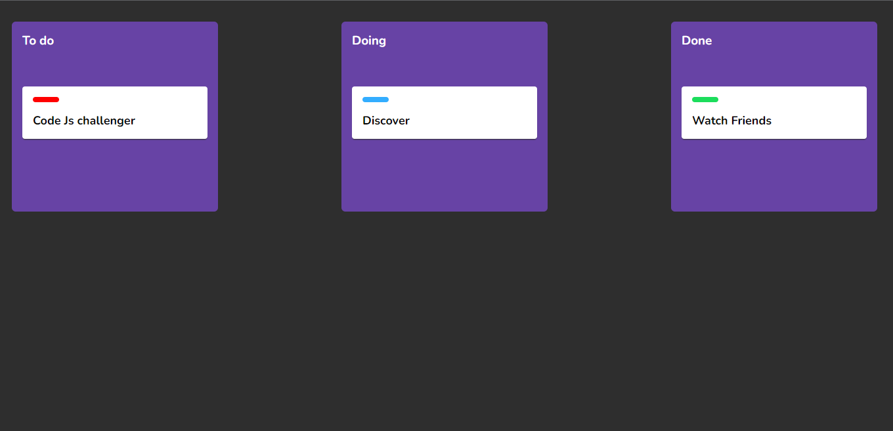
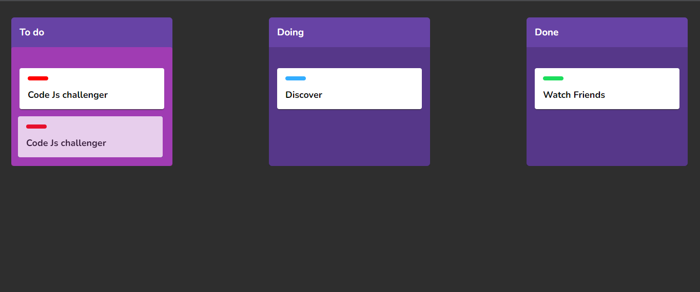
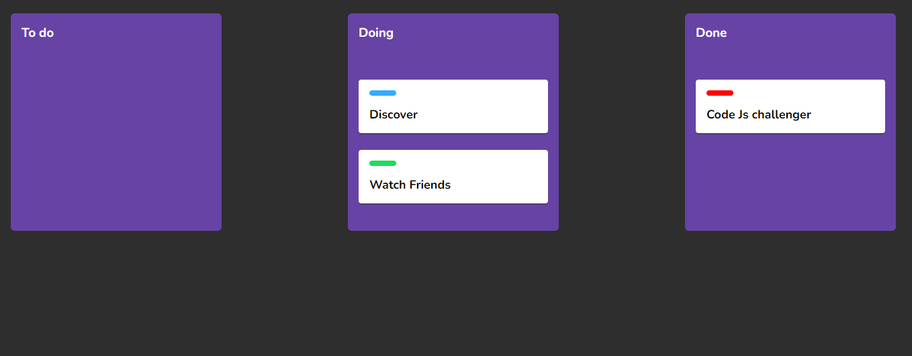

# 📌 Simple Kanban Board

## Visuals

## Description

The project is a Kanban board that allows you to manage all of your tasks.
The basis of the project was developed in a Rocketseat Masterclass using the Drag and Drop API from HTML5.
 
Link to Masterclass: <a target="_blank" href="https://youtu.be/6wn8hpUcEcM"> Drag and Drop Raiz com a API do HTML, CSS e JavaScript | Masterclass #16 </a>

## Techs

- HTML
- CSS
- JavaScript

## Contributing

Pull requests are welcome.
